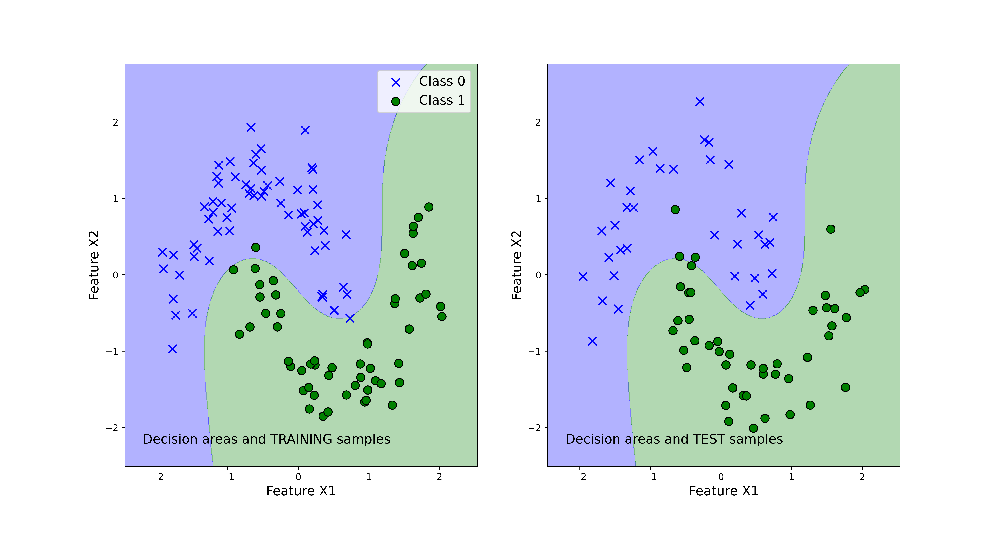

# Implementation-of-Voting-Classifier-in-Scikit-learn-and-Python---Ensemble-Machine-Learning

This repository explains how to implement the voting classifier in Scikit-learn and Python. These codes are the part of tutorals on ensemble machine learning and classification. The YouTube page explaining these code files is given below:

https://aleksandarhaber.com/ensemble-learning-in-scikit-learn-voting-classifiers/

Explanation of the uploaded code files:

- "functions.py" this code file contains the implementation of the function "visualizeClassificationAreas" that is used to plot the decision boundaries and classification results

- "votingClassifier.py" - is the main file that implements the voting classifier

- "classification_results_svm.png" - is the figure generated by the code that shows the classification results and decision boundaries. The image is shown below.

